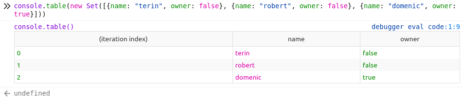
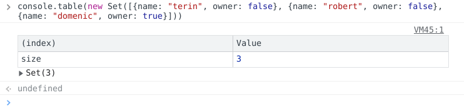
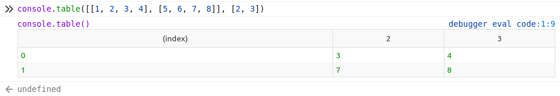
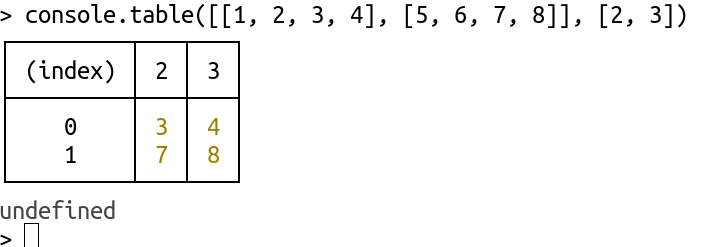
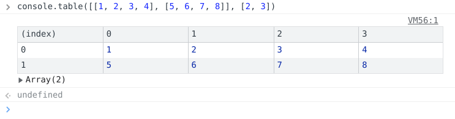
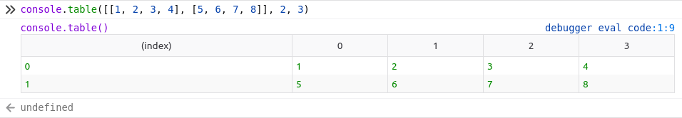
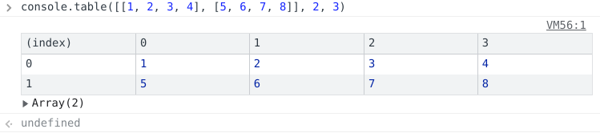
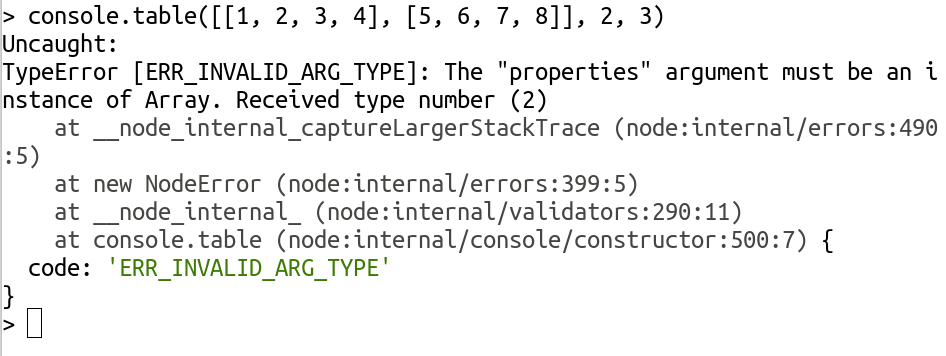

# Found differences

documenting the current status of affairs

## float formatter

FF / Firefox 112:

```js
console.log("%f", 23)
23.000000
```

Chrome / Chromium 112 / Nodejs 19.9:

```js
console.log("%f", 23)
23
```

FF / Firefox 112:

```
console.log('bjoern and robert are born on the %fst dec', 1.234)
bjoern and robert are born on the 1.234000st dec
```

Chrome / Chromium 112 / Nodejs 19.9:

```
console.log('bjoern and robert are born on the %fst dec', 1.234)
bjoern and robert are born on the 1.234st dec
```

FF / Firefox 112:

```js
console.log("%f", null)
0.000000
```

Chrome /Chromium 112 /Nodejs 19.9:

```js
console.log("%f", null)
NaN
```

## integer formatter

### integer formatting `null`

FF / Firefox 112 / Nodejs 19.9:

```js
console.log("%d", null)
0
```

Chrome / Chromium 112:

```js
console.log("%d", null)
NaN
```

### integer formatting a string

FF / Firefox 112:

```
console.log('bjoern and robert are born on the %dst dec', "foo")
bjoern and robert are born on the 0st dec
```

Chrome / Chromium 112 / Nodejs 19.9:

```js
console.log('bjoern and robert are born on the %dst dec', "foo")
bjoern and robert are born on the NaNst dec
```

## not enough arguments to interpolate all placeholders

FF / Firefox 112:

```js
console.log("%s %snewword", "duck")
duck newword
```

Chrome / Chromium 112 / Nodejs 19.9:

```js
console.log("%s %snewword", "duck")
duck %snewword
```

## console.assert - string formatter

FF / Edge:

```js
console.assert(false, "robert keeps %s on his balcony", "plaices")
robert keeps plaices on his balcony
```

Chrome:

```js
console.assert(false, "robert keeps %s on his balcony", "plaices")
Assertion failed: robert keeps %s on his balcony plaices
```

Firefox 112 / Chromium 112/ Nodejs 19.9:

```js
console.assert(false, "robert keeps %s on his balcony", "plaices")
    Assertion failed: robert keeps plaices on his balcony
```


## console.assert

FF / Edge:

```js
console.assert(false, "robert keeps %s on his balcony", {foo: "bar"})
robert keeps [object Object] on his balcony
```

Chrome:

```js
console.assert(false, "robert keeps %s on his balcony", {foo: "bar"})
Assertion failed: robert keeps %s on his balcony Object {foo: "bar"}
```

Firefox 112 / Chromium 112:

```js
console.assert(false, "robert keeps %s on his balcony", {foo: "bar"})
Assertion failed: robert keeps [object Object] on his balcony
undefined
```

Nodejs 19.9

```js
console.assert(false, "robert keeps %s on his balcony", {foo: "bar"})
Assertion failed: robert keeps { foo: 'bar' } on his balcony
```


## console.table - printing of strings

FF:

```js
console.table("the plaice living on the balcony")
```


Chrome / Chromium 112 / Firefox 112/ Nodejs 19.9:

```js
console.table("the plaice living on the balcony")
the plaice living on the balcony
```


## console.table - Sets

FF:

```js
console.table(new Set([{name: "terin", owner: false}, {name: "robert", owner: false}, {name: "domenic", owner: true}]))
```


Chrome:

```js
console.table(new Set([{name: "terin", owner: false}, {name: "robert", owner: false}, {name: "domenic", owner: true}]))
```


Implementations seem to have changed, but still all 3 are different:

Firefox 112:



Chromium 112:



Nodejs 19.9:

[Image of Nodejs displaying the indices of the Set as a table](images/notes/console.table-set-nodejs19.9.png)


## console.table - Indices

FF:

```js
console.table([[1, 2, 3, 4], [5, 6, 7, 8]], [2, 3])
```


Chrome:

 


Firefox 112 and Node 19.9 have Chrome's old behaviour.

Firefox 112:



Node 19.9:



While Chromium is doing something completely different:

Chromium 112:



## console.table - Multiple Arguments

```js
console.table([[1, 2, 3, 4], [5, 6, 7, 8]], 2, 3)
```

FF:


Chrome:


Firefox 112 looks more similar to Chrome's old behaviour:



Chromium 112 is also almost the same:



Nodejs 19.9 the only to give an invalid argument type error:



* Firefox 112 and Chromium 112 seem to emit some sort of information? Either because they indicate a debugger (Firefoy 112) or a `VM56:1`. Note the `console.table()` in the end of Firefox 112, and the `Array(2)` in the end of Chromium's output.


## console.count - counters and label repetition

Edge:

```js
console.count('foo')
undefined
foo:           2
console.count('foo')
undefined
```

FF / Chrome / Chromium 112 / Firefox 112 / Nodejs 19.9:

```js
console.count('foo')
foo: 1
undefined
console.count('foo')
foo: 2
undefined
```

*Edge: the counter is raised where the first label `foo` is printed*
<br/>
*FF/Chrome/etc: the label is printed multiple times with the current counter*


## console.count - objects / arrays

Edge:

```js
console.count({})
undefined
[object Object]: 1

console.count([])
undefined
:           1
```

Chrome / Nodejs 19.9:

```js
console.count({})
[object Object]: 1
undefined

console.count([])
: 1
undefined
```

Chromium 112 doesn't show the colon anymore when counting `[]`:

```js
console.count({})
[object Object]: 1
undefined

console.count([])
1
undefined
```

FF / Firefox 112:

```js
console.count({})
[object Object]: 1
undefined

console.count([])
<no label>: 1
undefined
```

*`<no label>` appears in FF*

## console.count - no arguments

Edge:

```js
console.count()
undefined
: 1
```

Chrome:

```js
console.count()
: 1
undefined
```

FF:

```js
console.count()
<no label>: 1
undefined
```

*`<no label>` appears in FF*


Firefox 112 / Chromium 112 / Nodejs 19.9:

```js
console.count()
default: 1
undefined
```
* Firefox 112 actually mentions a debugger and Chromium a `VM..:.`. Nodejs 19.9 doesn't.

## - no arguments / empty strings

Edge:

```js
console.count()
: 1
undefined

console.count("")
: 1
undefined
```

Chrome:

```js
console.count()
: 1
undefined

console.count("")
: 2
undefined
```

FF:

```js
console.count()
<no label>: 1
undefined
console.count("")
<no label>: 2
undefined
```

Firefox 112:

```js
console.count()
default: 1
undefined

console.count("")
<no label>: 1
undefined
```

Chromium 112:

```js
console.count()
default: 1
undefined

console.count("")
1
undefined
```

Nodejs 19.9:

```js
console.count()
default: 1
undefined

console.count("")
: 1
undefined
```

* Firefox 112 and Chromium 112 now don't increment (probably related to their use of `default`).
*Chrome/FF count no-arguments and empty-string as the same counter, FF adds `<no label>`.*
<br>
*Edge counts empty-string and no-arguments separetely*

## console.count - null

Edge:

```js
console.count(null)
undefined
: 2
```

Chrome:

```js
console.count(null)
null: 2
undefined
```

FF / Nodejs 19.9 / Chromium 112 / Firefox 112:

```js
console.count(null)
null: 1
undefined
```

*Edge has no label*

## console.count - undefined

Edge:

```js
console.count(undefined)
: 1
undefined
```

Chrome:


```js
console.count(undefined)
undefined: 1
undefined
```

FF:

```js
console.count(undefined)
undefined: 1
undefined
```

Firefox 112 / Chromium 112 / Nodejs 19.9:

```js
console.count(undefined)
default: 1
undefined
```

*Edge has no label*


## console.time - no param/undefined

FF:

```js
console.time() // no timer started
console.time(undefined) // no timer started
```

Bug: https://bugzilla.mozilla.org/show_bug.cgi?id=1270636 (now closed)

Chrome:

```js
console.time()
console.time(undefined)

console.timeEnd()
default: <time in ms here>
console.timeEnd()
undefined: <time in ms here>
```

Bug: https://bugs.chromium.org/p/chromium/issues/detail?id=696798 (still open)

Firefox 112:

```js
console.time()
undefined

console.time(undefined)
⚠ Timer “default” already exists.                 debugger eval code:1:9
undefined
```

Chromium 112 is almost identical:

```js
console.time()
undefined

console.time(undefined)
⚠ ▾Timer 'default' already exists                   VM316:1
   (anonymous) @ VM316:1
undefined
```

Nodejs 19.9 also:

```js
console.time()
undefined

console.time(undefined)
undefined
> (node:20286) Warning: Label 'default' already exists for console.time()
(Use `node --trace-warnings ...` to show where the warning was created)
```
## console.time - label conversion / conversion errors

FF:

```js
console.time({ toString() {throw new Error("Farolino")} }) // toString called, no error thrown, no timer started
```

Bug: https://bugzilla.mozilla.org/show_bug.cgi?id=1343013

Chrome:

```js
console.time({ toString() { return 'conversion' } }) // timer started with label `[object Object]`

console.timeEnd('conversion')
console.timeEnd({})
[object Object]: <time in ms here>

// ...

console.time({ toString() { throw new Error("Farolino") } }) // toString never called, no timer started
```

Bug: https://bugs.chromium.org/p/chromium/issues/detail?id=696805

Edge:

```js
console.time({ toString() { throw new Error("Farolino") } }) // toString called, no error thrown, no timer started
```

Bug: https://developer.microsoft.com/en-us/microsoft-edge/platform/issues/11201116/


Firefox 112:


Chromium 112:


Nodejs 19.9:

```js
console.time({ toString() { throw new Error("Farolino") } }) // toString called, no error thrown, no timer started
Uncaught Error: Farolino
    at Object.toString (REPL1:1:35)
    at console.time (node:internal/console/constructor:395:5)
```

